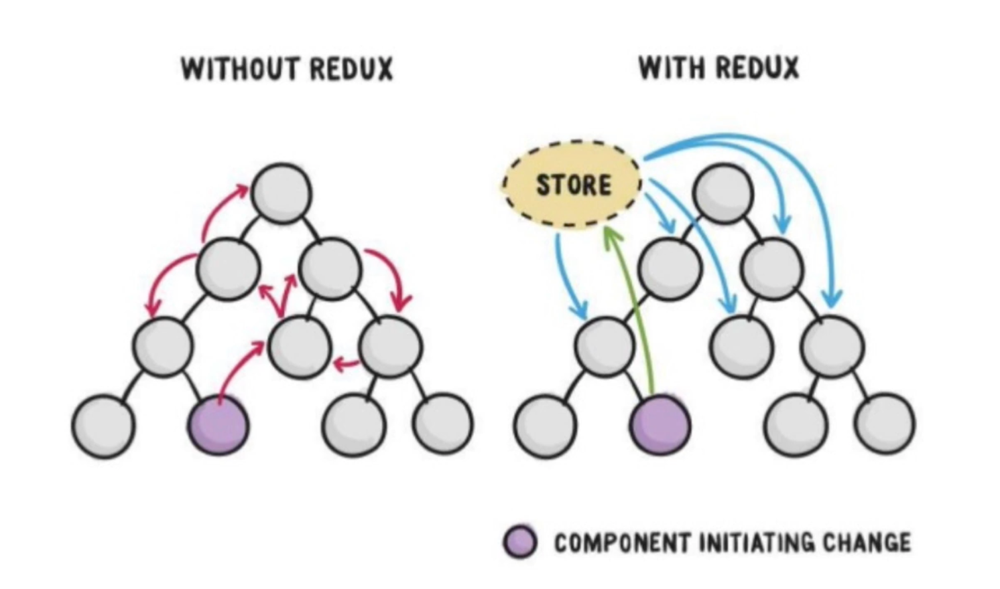

✨ react-redux 공부 & 기록용 저장소입니다.

</br>

### React와 React Redux의 데이터 흐름 비교

---



→ 리액트는 소문과 같고, 리덕스는 미디어와 같다.

리액트는 컴포넌트들로 만들어진 사회와 비슷하다. 어떤 컴포넌트에서 변화가 생기면 소문처럼 모든 컴포넌트들로 그 데이터가 전파된다. 그 데이터가 필요한 컴포넌트는 그것을 이용하면 되고, 필요하지 않은 컴포넌트들은 이용하지 않으면 된다. 이것의 단점은 모든 컴포넌트가 필요없는 소문까지 듣게 되는 것이다. 쉽게 리액트로 치면 Render 함수가 호출되는 것이다. 또한, 소문이 전파되기 위해선 props와 같이 컴포넌트마다 연결되어 있어야 한다.

반면, 리덕스는 언론사다. 모든 정보는 리덕스가 갖고있으며, 어떤 컴포넌트가 구성원들에게 전달하고 싶은 정보가 있다면 소문 대신 언론사에 제보하는 것이다. 그럼 리덕스는 전체 컴포넌트들에게 방송을 하고, 전체에게 하고싶은 말이 있으면 리덕스의 스토어에 제보하면 되는 것이다. 하지만 이 또한 필요하지 않은 컴포넌트들에게도 정보가 전달되는 비효율성은 여전하다.

리액트 리덕스를 사용하면 그 데이터가 필요한 컴포넌트들에게만 정보를 전달할 수 있다. 다시 말해, 그 컴포넌트들만 렌더함수가 실행된다는 뜻이다.

</br>

### React 컴포넌트에서 redux에 종속된 기능 제거 (redux)

---

react component는 부품으로서의 가치가 있다. 애플리케이션 안에서 여러군데 사용할 수 있고, 다른 애플리케이션에서 또한 사용할 수 있다. 이런 컴포넌트에서 직접적으로 redux를 사용하는 것은 다른 애플리케이션에서의 재사용이 힘들다. 이 문제는 <span style="color: dodgerblue">**Container Component**</span> 와 <span style="color: dodgerblue">**Presentational Component**</span> 구조로 해결할 수 있다. 이것은 리덕스를 사용할 때 가장 많이 사용하는 패턴이다.

</br>

<span style="color: dodgerblue">**Container Component**</span>

- 마크업과 스타일을 갖는다.
- 리덕스의 Store에 의존하지 않는다.
- 데이터를 직접적으로 변경하지 않는다.
- 직접적으로 보여지는 부분의 UI를 담당한다.
- Props를 통해 데이터와 Callback을 전달받는다.

</br>

<span style="color: dodgerblue">**Presentational Component**</span>

- 데이터 핸들링을 위주로 개발한다.
- 마크업이나 스타일은 모두 프레젠테이셔널 컴포넌트 내부에서 정의되어야 한다.
- 리덕스의 action이나 상태 변경에 대한 로직을 담고 있다. (dispatch하는 함수를 여기서 담당한다.)
- 상태를 갖고있고 리덕스에 직접 접근하여 데이터를 가져온다.
- 프레젠테이셔널 컴포넌트에 해당 상태를 전달하거나 함수를 제공한다.
- 다른 프레젠테이셔널 컴포넌트나 컨테이너 컴포넌트를 관리한다.

</br>

> 쉽게 말해, 프레젠테이셔널 컴포넌트에서 redux라는 것을 모르도록 개발하고, 컨테이너 컴포넌트에서 리덕스의 store를 핸들링하는 컴포넌트로 만든다.

❗️ 꼭 리덕스에 종속된다고 안좋은 것이 아니다. 다른 곳에서 사용될 가능성이 없다면 리덕스에 종속되어도 상관없다. 상황에 따라 적절히 사용할 것.

</br>

### React Redux 설치하기

---

```
npm install --save react-redux
```

</br>

### Provider 컴포넌트를 사용해 리액트 앱에 store 연동하기

---

`Provider`는 react-redux 라이브러리에서 제공하는, 리액트 앱에 `store를` 손쉽게 연동할 수 있도록 도와주는 컴포넌트이다. 최상위 루트에서 `Provider`를 import 해준 후 최상위 컴포넌트를 `Provider`로 감싸 `store`값을 설정해주면 된다. <span style="color:rgba(86, 139, 86, 0.993)">\* store도 import 해주어야한다.</span>

```jsx
src / index.js;

import React from 'react';
import ReactDOM from 'react-dom';
import './index.css';
import App from './App';
import reportWebVitals from './reportWebVitals';
import { Provider } from 'react-redux';
import store from './store';

ReactDOM.render(
  <Provider>
    <App />
  </Provider>,
  document.getElementById('root')
);

reportWebVitals();
```

`Provider`의 `store`라고 하는 프롭스를 전달해줌으로써 리덕스 `store`를 공급해주었다. `Provider` 컴포넌트 하위의 모든 컴포넌트들은 import를 따로 시키지 않아도 리덕스 `store`에 접근할 수 있게 된다.

</br>

### react와 redux를 연결하는 함수 connect()

---

`connect` 함수는 `provider` 컴포넌트 하위에 존재하는 모든 컴포넌트들이 store에 접근할 수 있도록 도와주는 함수다.

```jsx
import React, { connect } from 'react-redux';
import AddNumber from '../components/addNumber';

const mapStateToProps(state) {
  return {number: state.number}
}

const mapStateToProps(dispatch) {
  return {
    onClick: (size) => {
      dispatch({ type: 'INCREMENT', size: size });
    },
  };
}

export default connect(mapStateToProps, mapDispatchToProps)(AddNumber);

```

connect를 실행하면 리턴값이 함수가 되고 리턴된 함수가 다시 실행하는 것을 통해 만들어진 값을 export 한다. Presentational 컴포넌트(하위 컴포넌트)를 인자로 전달하게 되면 전달된 컴포넌트가 Container Component가 되어 리턴된다. 상위 컴포넌트와 하위 컴포넌트의 props 전달을 자동으로 처리해준다.

mapStateToProps 는 connect 함수에 첫번째 인수로 들어가는 함수 혹은 객체이다. 기본적으로 store가 업데이트 될 때마다 자동적으로 호출된다. 업데이트 될 state가 없다면 null 또는 undefined값을 할당해준다.

mapDispatchToProps 는 connect 함수의 두번째 인자로 사용된다. 기본적으로 store에 접근한 컴포넌트가 store의 상태를 바꾸기 위해 dispatch를 사용할 수 있게 만들어 준다.

mapReduxDispatch를 React의 props에 맵핑(연결)해준다. connect의 정확한 동작 방식을 이해하고 싶다면 아래 링크된 git 페이지를 참고할 수 있다.

→ <a href="https://gist.github.com/gaearon/1d19088790e70ac32ea636c025ba424e">gaearon/connect.js</a>
